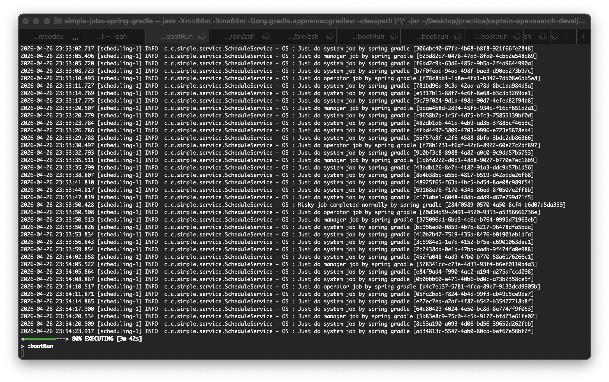
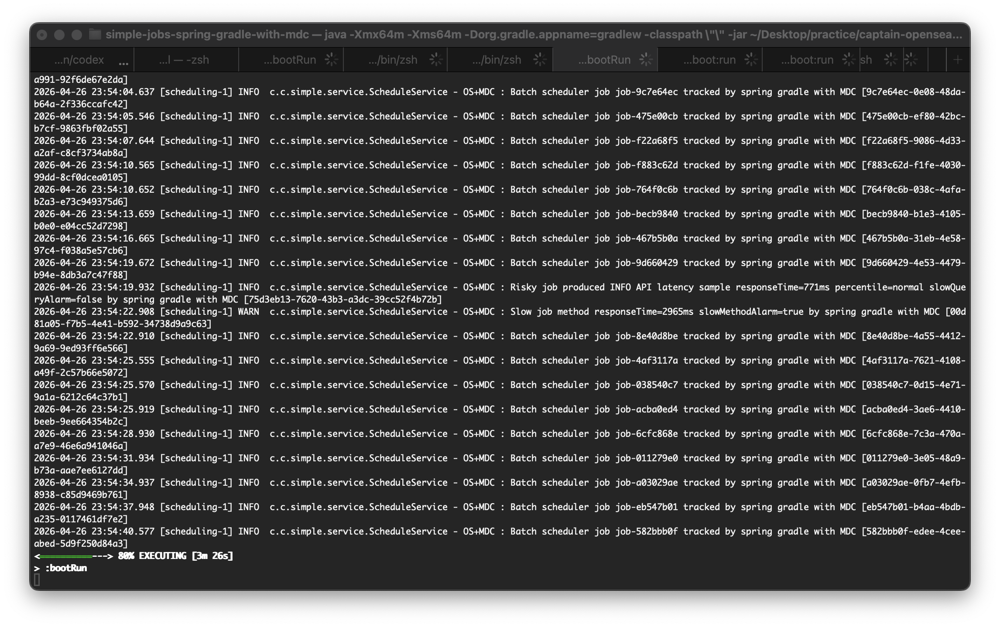
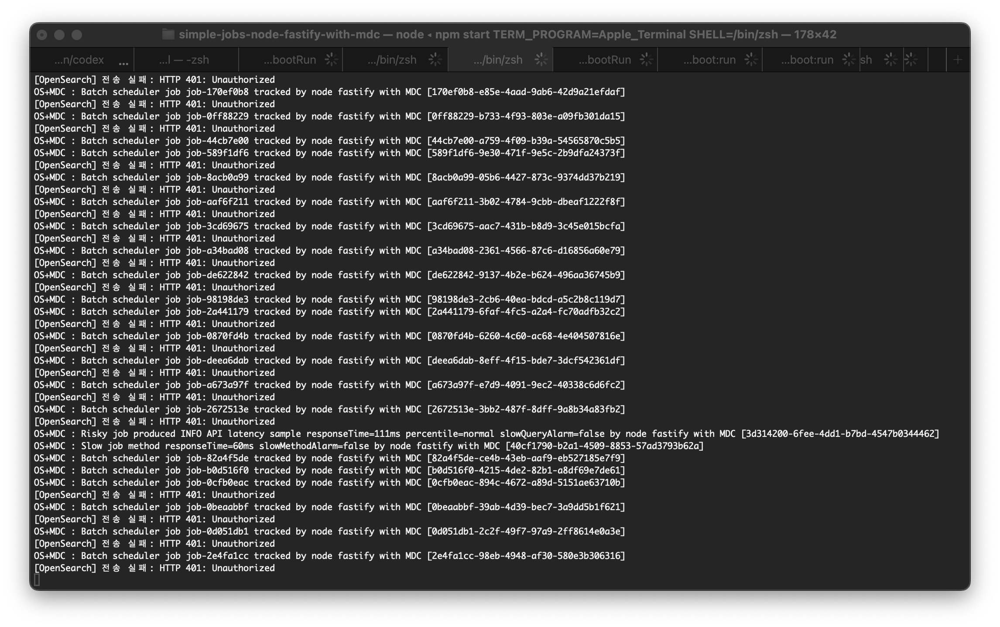
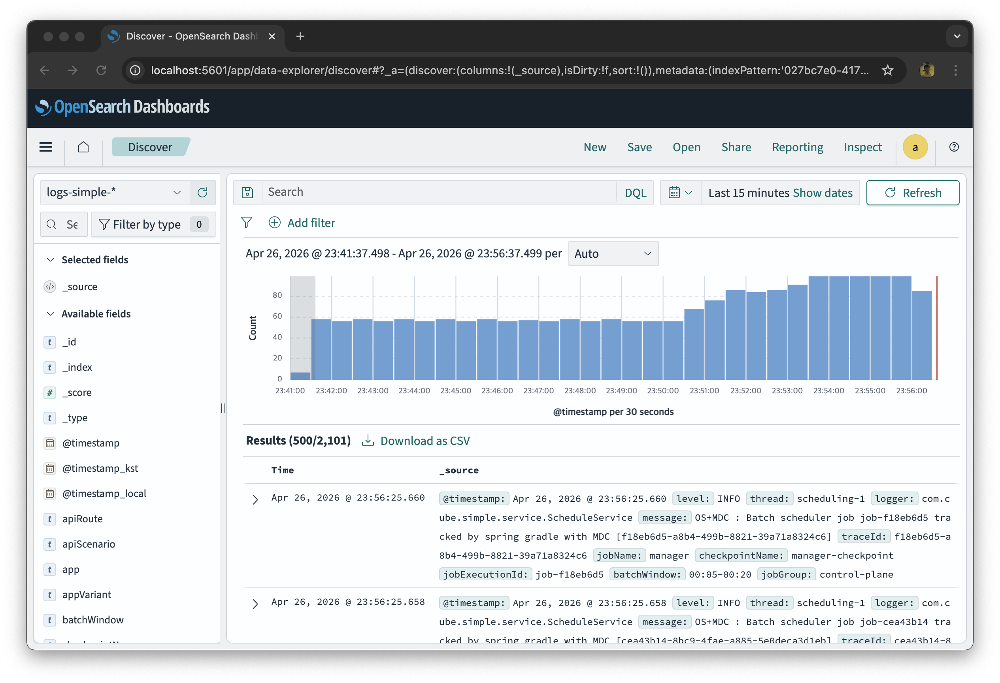
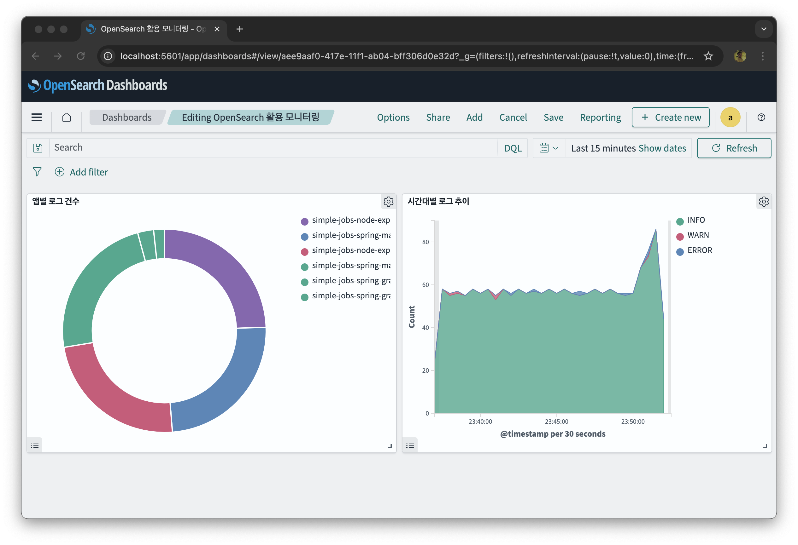

# OpenSearch 연동 모니터링 환경 구축건

다양한 기술 스택(Spring Boot, Node.js, Python)으로 구성된 배치잡·REST API 앱에  
**OpenSource Appender 커스터마이징** 기반의 OpenSearch Appender를 적용하여 통합 로그 모니터링 환경을 구축한 데모 프로젝트입니다.

> **인프라 환경** : 프라이밋 클라우드 VM 운영 환경 — 추가 패키지 설치 및 커스텀 서버 설정 불가
> → 각 런타임의 **표준 라이브러리만** 사용하고, OpenSource Appender 커스터마이징 방식으로 구현

---

## 목차

0. [시작 전 — 설정 파일 준비](#0-시작-전--설정-파일-준비)
1. [앱 목록 및 빌드·실행 방법](#1-앱-목록-및-빌드실행-방법)
2. [공용 OpenSearch Appender 라이브러리 구성](#2-공용-opensearch-appender-라이브러리-구성)
3. [OpenSearch 연동 로깅 항목](#3-opensearch-연동-로깅-항목)
4. [Docker로 OpenSearch + Dashboards 실행](#4-docker로-opensearch--dashboards-실행)
5. [Index 생성 및 앱 로그 모니터링 (curl)](#5-index-생성-및-앱-로그-모니터링-curl)
6. [Dashboards > Discover 활용](#6-dashboards--discover-활용)
7. [Dashboards > Visualize 활용](#7-dashboards--visualize-활용)
8. [실행 및 모니터링 화면 예시](#8-실행-및-모니터링-화면-예시)

---

## 0. 시작 전 — 설정 파일 준비

> **보안 주의** : `application.properties` 와 `.env` 파일은 `.gitignore` 에 등록되어 있습니다.  
> 각 프로젝트의 예시 파일을 복사한 후 필요시 값을 수정하여 사용하세요.

### Spring Boot 프로젝트

```bash
# 각 Spring Boot 프로젝트 디렉터리에서 실행 (예: simple-rest-spring-maven)
cp src/main/resources/application-example.properties src/main/resources/application.properties
```

예시 파일(`application-example.properties`)에는 로컬 테스트에 필요한 모든 설정이 포함되어 있어  
복사 후 바로 실행 가능합니다.

### Node.js / Python / React 프로젝트

```bash
# 각 프로젝트 디렉터리에서 실행 (예: simple-rest-node-express)
cp .env-example .env
```

예시 파일(`.env-example`)에는 로컬 테스트에 필요한 모든 설정이 포함되어 있어  
복사 후 바로 실행 가능합니다.

---

## 1. 앱 목록 및 빌드·실행 방법

### 1-0. 공용 라이브러리 (Spring Boot 전용)

| 디렉터리 | groupId | artifactId | version |
|---|---|---|---|
| `lib/simple-lib-spring-opensearch-appender-3.0.0` | `com.cube` | `simple-lib-spring-opensearch-appender` | `3.0.0` |
| `lib/simple-lib-spring-opensearch-appender-bulk-only-3.0.0` | `com.cube` | `simple-lib-spring-opensearch-appender-bulk-only` | `3.0.0` |

Spring Boot 배치잡/REST API 앱이 공통으로 사용하는 OpenSearch Appender 라이브러리.  
Maven Central 에 배포되지 않으므로 **개발자 로컬 `.m2` 저장소에 직접 설치**해야 한다.  
설치 후 각 Spring Boot 앱이 일반 Maven/Gradle 의존성처럼 참조한다.

Spring Boot용 공용 라이브러리는 `lib/logback-elasticsearch-appender-3.0.19` 원본을 기준으로 구성했다.

| 라이브러리 | 설명 |
|---|---|
| `lib/logback-elasticsearch-appender-3.0.19` | OpenSource Appender 커스터마이징 기준 원본 |
| `lib/simple-lib-spring-opensearch-appender-3.0.0` | 원본과 동일 기능 제공 |
| `lib/simple-lib-spring-opensearch-appender-bulk-only-3.0.0` | 본 프로젝트에서 요구하는 로그 모니터링 전용 기능 구현 |

`bulk-only` 변형은 패키지명, 클래스명, 설정 파라미터를 동일하게 유지하되 `<operation>` 값을 OpenSearch `_bulk` 의 `index` / `create` 액션으로만 제한한다.

#### 설치 방법

```bash
# 1. 라이브러리 디렉터리로 이동
cd lib/simple-lib-spring-opensearch-appender-bulk-only-3.0.0

# 2. Maven Wrapper 로 빌드 & 로컬 .m2 설치
#    (mvn 이 전역 설치되어 있으면 mvn install -q 로 대체 가능)
../../simple-jobs-spring-maven/mvnw install -q
```

> **Maven Wrapper(`mvnw`)를 쓰는 이유**  
> 이 라이브러리 자체는 `mvnw`를 가지고 있지 않다.  
> 인접한 `simple-jobs-spring-maven/mvnw` 를 빌려 실행하면 별도 Maven 설치 없이 동작한다.

#### 설치 확인

```bash
ls ~/.m2/repository/com/cube/simple-lib-spring-opensearch-appender-bulk-only/3.0.0/
# 아래 두 파일이 있으면 정상
# simple-lib-spring-opensearch-appender-bulk-only-3.0.0.jar
# simple-lib-spring-opensearch-appender-bulk-only-3.0.0.pom
```

#### 소비 앱 의존성 선언

설치 후 각 Spring Boot 앱에서 아래와 같이 참조한다.

**Maven (`pom.xml`)**
```xml
<dependency>
    <groupId>com.cube</groupId>
    <artifactId>simple-lib-spring-opensearch-appender-bulk-only</artifactId>
    <version>3.0.0</version>
</dependency>
```

**Gradle (`build.gradle`)**
```gradle
repositories {
    mavenLocal()        // 로컬 .m2 를 먼저 탐색
    mavenCentral()
}

dependencies {
    implementation 'com.cube:simple-lib-spring-opensearch-appender-bulk-only:3.0.0'
}
```

> **`mavenLocal()` 이 필요한 이유**  
> Gradle 은 기본적으로 로컬 `.m2` 를 탐색하지 않는다.  
> `repositories` 블록에 `mavenLocal()` 이 없으면 로컬 설치된 JAR 를 찾지 못해 빌드가 실패한다.

#### 재설치가 필요한 경우

라이브러리 소스를 수정한 경우 반드시 재설치 후 소비 앱을 다시 빌드해야 한다.

```bash
cd lib/simple-lib-spring-opensearch-appender-bulk-only-3.0.0
../../simple-jobs-spring-maven/mvnw install -q   # 재설치

# 이후 각 소비 앱 재빌드
cd ../../simple-jobs-spring-maven  && ./mvnw package -q -DskipTests
cd ../simple-jobs-spring-gradle && ./gradlew build -x test -q
cd ../simple-rest-spring-maven  && ./mvnw package -q -DskipTests
cd ../simple-rest-spring-gradle && ./gradlew build -x test -q
```

### 1-0-1. 공용 라이브러리 (Python 전용)

| 디렉터리 | 패키지명 | version |
|---|---|---|
| `lib/simple-lib-python-opensearch-appender-1.0.0` | `opensearch-appender` | `1.0.0` |
| `lib/simple-lib-python-opensearch-appender-bulk-only-3.0.0` | `opensearch-appender-bulk-only` | `3.0.0` |

Python 배치잡/REST API 앱이 공통으로 사용하는 OpenSearch Appender 라이브러리.  
PyPI에 배포되지 않으므로 **개발자 로컬 환경에 직접 설치**해야 한다.  
설치 후 각 Python 앱이 일반 패키지처럼 `import` 할 수 있다.

`bulk-only` 변형은 import 패키지명과 클래스명을 기존과 동일하게 유지하되 `_bulk` 작업을 `index` / `create` 액션으로만 제한하고, 응답 item별 partial failure 분석, retry, 재큐 설정을 지원한다.

#### 설치 방법

각 Python 소비 앱의 `requirements.txt` 에 `../lib/simple-lib-python-opensearch-appender-bulk-only-3.0.0` 가 포함되어 있으므로  
**별도 설치 없이** 앱 디렉터리에서 `pip install -r requirements.txt` 하나로 완결된다.

```bash
# 예: simple-rest-python-flask 기준
cd simple-rest-python-flask
python -m venv venv && source venv/bin/activate
pip install -r requirements.txt   # 라이브러리 포함 전체 설치
python main.py
```

#### 소비 앱 import 선언

문서에서는 Job / Web 용도를 모두 `OpenSearchAppender` 공통 표기명으로 정리한다.

**OpenSearchAppender (Flask / FastAPI Job 모듈 공통)**
```python
from opensearch_appender.job_appender import OpenSearchAppender
```

**OpenSearchAppender (Flask Web 모듈)**
```python
from opensearch_appender.web_appender_flask import OpenSearchAppender
```

**OpenSearchAppender (FastAPI Web 모듈)**
```python
from opensearch_appender.web_appender_fastapi import OpenSearchAppender
```

#### 라이브러리 소스 수정 후 재설치가 필요한 경우

`requirements.txt` 경로 방식은 수정 시 재설치가 필요하다.

```bash
# 각 소비 앱 가상환경에서 재설치
pip install --force-reinstall ../lib/simple-lib-python-opensearch-appender-bulk-only-3.0.0
```

---

### 1-0-2. 라이브러리 소스 내장 변형 (Spring Boot 전용, 로컬 설치 불필요)

| 디렉터리 | 내장 라이브러리 | 내장 패키지 |
|---|---|---|
| `simple-jobs-spring-maven-full` | `lib/simple-lib-spring-opensearch-appender-3.0.0` (full) | `com.cube.simple.opensearch` |
| `simple-jobs-spring-maven-bulk` | `lib/simple-lib-spring-opensearch-appender-bulk-only-3.0.0` (bulk-only) | `com.cube.simple.opensearch` |

공용 라이브러리를 로컬 `.m2`에 설치하지 않고도 바로 빌드·실행할 수 있는 **소스 내장 변형** 프로젝트.  
`lib/` 라이브러리 소스를 `com.cube.simple.opensearch` 패키지로 프로젝트에 직접 포함하여 `pom.xml` 외부 의존성 선언이 없어도 동작한다.  
외부 Maven 저장소나 로컬 `.m2` 설치 없이 `./mvnw spring-boot:run` 한 줄로 바로 실행 가능하다.

| 항목 | `simple-jobs-spring-maven-full` | `simple-jobs-spring-maven-bulk` |
|---|---|---|
| 기반 라이브러리 | `simple-lib-spring-opensearch-appender-3.0.0` | `simple-lib-spring-opensearch-appender-bulk-only-3.0.0` |
| 기본 `operation` | `index` | `index` |
| 기본 `persistentWriterThread` | `false` | `true` |
| `requeueOnFailure` | 미지원 | `true` (기본) |
| 허용 `operation` | `index`, `create`, `update`, `delete` | `index`, `create` 만 허용 |

> 두 변형 모두 `logback-spring.xml` Appender 클래스 경로는 `com.cube.simple.opensearch.OpenSearchAppender` / `com.cube.simple.opensearch.OpenSearchBasicAuthentication` 를 사용한다.

---

### 1-1. 프런트 앱

| 디렉터리 | 기술 스택 | 포트 | 설명 |
|---|---|---|---|
| `simple-page-react-nextjs` | React / Next.js 14 | 3000 | Swagger-UI 유사 CRUD 데모 프런트 |

```bash
cd simple-page-react-nextjs
npm install
npm run dev          # 개발 서버
# npm run build && npm start  # 프로덕션
```

접속 : http://localhost:3000

---

### 1-2. 배치잡 앱

| 디렉터리 | 기술 스택 | 포트 | 빌드 도구 |
|---|---|---|---|
| `simple-jobs-spring-maven`  | Spring Boot 3.5 | - | Maven |
| `simple-jobs-spring-gradle` | Spring Boot 3.5 | - | Gradle |
| `simple-jobs-spring-maven-with-mdc`  | Spring Boot 3.5 + MDC 예제 | - | Maven |
| `simple-jobs-spring-gradle-with-mdc` | Spring Boot 3.5 + MDC 예제 | - | Gradle |
| `simple-jobs-spring-maven-full`  | Spring Boot 3.5 + 라이브러리 소스 내장 (full, 로컬 설치 불필요) | - | Maven |
| `simple-jobs-spring-maven-bulk`  | Spring Boot 3.5 + 라이브러리 소스 내장 (bulk-only, 로컬 설치 불필요) | - | Maven |
| `simple-jobs-node-express`  | Node.js / Express | - | npm |
| `simple-jobs-node-fastify`  | Node.js / Fastify | - | npm |
| `simple-jobs-node-nestjs`   | Node.js / NestJS  | - | npm |
| `simple-jobs-node-express-with-mdc`  | Node.js / Express + MDC 예제 | - | npm |
| `simple-jobs-node-fastify-with-mdc`  | Node.js / Fastify + MDC 예제 | - | npm |
| `simple-jobs-node-nestjs-with-mdc`   | Node.js / NestJS + MDC 예제  | - | npm |
| `simple-jobs-python-flask`  | Python / Flask + APScheduler | - | pip |
| `simple-jobs-python-fastapi`| Python / FastAPI + APScheduler | - | pip |
| `simple-jobs-python-flask-with-mdc`  | Python / Flask + APScheduler + MDC 예제 | - | pip |
| `simple-jobs-python-fastapi-with-mdc`| Python / FastAPI + APScheduler + MDC 예제 | - | pip |

#### Spring Boot (Maven / Gradle)

```bash
# 공통 라이브러리 재설치가 필요한 경우 먼저 수행
cd lib/simple-lib-spring-opensearch-appender-bulk-only-3.0.0
../../simple-jobs-spring-maven/mvnw install -q

# Maven
cd simple-jobs-spring-maven
cp src/main/resources/application-example.properties src/main/resources/application.properties
./mvnw spring-boot:run

# Maven + MDC
cd simple-jobs-spring-maven-with-mdc
cp src/main/resources/application-example.properties src/main/resources/application.properties
./mvnw spring-boot:run

# Gradle
cd simple-jobs-spring-gradle
cp src/main/resources/application-example.properties src/main/resources/application.properties
./gradlew bootRun

# Gradle + MDC
cd simple-jobs-spring-gradle-with-mdc
cp src/main/resources/application-example.properties src/main/resources/application.properties
./gradlew bootRun

# Maven + 소스 내장 full (로컬 .m2 설치 불필요)
cd simple-jobs-spring-maven-full
cp src/main/resources/application-example.properties src/main/resources/application.properties
./mvnw spring-boot:run

# Maven + 소스 내장 bulk-only (로컬 .m2 설치 불필요)
cd simple-jobs-spring-maven-bulk
cp src/main/resources/application-example.properties src/main/resources/application.properties
./mvnw spring-boot:run
```

#### Spring Boot + MDC 연동 절차

Spring 배치 앱에 MDC를 얹어 OpenSearch로 함께 적재하려면 아래 순서로 진행합니다.

1. `lib/simple-lib-spring-opensearch-appender-bulk-only-3.0.0` 를 로컬 `.m2` 에 설치합니다.
2. 소비 앱 `pom.xml` 또는 `build.gradle` 에 `com.cube:simple-lib-spring-opensearch-appender-bulk-only:3.0.0` 의존성을 둡니다.
3. `application-example.properties` 를 `application.properties` 로 복사합니다.
4. `logback-spring.xml` 에 `OpenSearchAppender` 를 등록하고 `includeMdc=true`, `includeKvp=true`, `operation=index` 같은 값을 설정합니다.
5. 배치 코드에서 `MDC.put("traceId", ...)`, `MDC.put("jobName", ...)` 식으로 커스텀 필드를 넣고, 로그 출력 후 `MDC.clear()` 로 정리합니다.
6. 앱 실행 후 OpenSearch에 문서가 적재되는지 `curl` 또는 Dashboards Discover 로 확인합니다.

`simple-jobs-spring-maven-with-mdc`, `simple-jobs-spring-gradle-with-mdc` 는 위 절차가 이미 반영된 샘플입니다.

#### Node.js

```bash
# Express
cd simple-jobs-node-express
npm install && npm start

# Fastify
cd simple-jobs-node-fastify
npm install && npm start

# NestJS
cd simple-jobs-node-nestjs
npm install && npm run start:dev

# Express + MDC
cd simple-jobs-node-express-with-mdc
npm install && npm start

# Fastify + MDC
cd simple-jobs-node-fastify-with-mdc
npm install && npm start

# NestJS + MDC
cd simple-jobs-node-nestjs-with-mdc
npm install && npm run start:dev
```

> **Node.js v24 주의** : `better-sqlite3` 는 `^12.9.0` 이상 필요 (C++20 요구사항)  
> 오류 발생 시 → `rm -rf node_modules package-lock.json && npm install`

#### Python

```bash
# Flask + APScheduler
cd simple-jobs-python-flask
python -m venv venv && source venv/bin/activate   # Windows: venv\Scripts\activate
pip install -r requirements.txt                   # ../lib/simple-lib-python-opensearch-appender-bulk-only-3.0.0 포함
python main.py

# FastAPI + APScheduler
cd simple-jobs-python-fastapi
python -m venv venv && source venv/bin/activate
pip install -r requirements.txt
python main.py

# Flask + APScheduler + MDC
cd simple-jobs-python-flask-with-mdc
python -m venv venv && source venv/bin/activate
pip install -r requirements.txt
python main.py

# FastAPI + APScheduler + MDC
cd simple-jobs-python-fastapi-with-mdc
python -m venv venv && source venv/bin/activate
pip install -r requirements.txt
python main.py
```

---

### 1-3. REST API 앱

| 디렉터리 | 기술 스택 | 포트 | DB |
|---|---|---|---|
| `simple-rest-spring-maven`  | Spring Boot 3.5 + MyBatis | 9201 | H2 In-Memory |
| `simple-rest-spring-gradle` | Spring Boot 3.5 + MyBatis | 9202 | H2 In-Memory |
| `simple-rest-node-nestjs`   | NestJS + better-sqlite3   | 3201 | SQLite In-Memory |
| `simple-rest-node-express`  | Express + better-sqlite3  | 3202 | SQLite In-Memory |
| `simple-rest-node-fastify`  | Fastify + better-sqlite3  | 3203 | SQLite In-Memory |
| `simple-rest-python-flask`  | Flask + waitress          | 5201 | SQLite In-Memory |
| `simple-rest-python-fastapi`| FastAPI + uvicorn         | 5202 | SQLite In-Memory |

#### Spring Boot (Maven / Gradle)

```bash
# Maven (포트 9201)
cd simple-rest-spring-maven
./mvnw spring-boot:run

# Gradle (포트 9202)
cd simple-rest-spring-gradle
./gradlew bootRun
```

#### Node.js

```bash
# NestJS (포트 3201)
cd simple-rest-node-nestjs
npm install && npm run start:dev

# Express (포트 3202)
cd simple-rest-node-express
npm install && npm start

# Fastify (포트 3203)
cd simple-rest-node-fastify
npm install && npm start
```

#### Python

```bash
# Flask / waitress (포트 5201)
cd simple-rest-python-flask
python -m venv venv && source venv/bin/activate
pip install -r requirements.txt                   # ../lib/simple-lib-python-opensearch-appender-bulk-only-3.0.0 포함
python main.py

# FastAPI / uvicorn (포트 5202)
cd simple-rest-python-fastapi
python -m venv venv && source venv/bin/activate
pip install -r requirements.txt
python main.py
```

---

## 2. 공용 OpenSearch Appender 라이브러리 구성

> 공통 설계 원칙 : **추가 의존성 최소화** — Spring Boot는 공용 Logback Appender 라이브러리, Node/Python은 각 런타임 내장 라이브러리 중심으로 구현  
> Spring Boot 3.0.0 계열은 `OpenSearchAppender` 통합 클래스 하나를 사용하고, 배치/REST 구분 필드는 MDC 또는 custom properties로 주입한다.

### 2-1. 구성 파일 위치

| 앱 유형 | 기술 스택 | Appender 파일 |
|---|---|---|
| 배치잡 | Spring Boot | `lib/simple-lib-spring-opensearch-appender-bulk-only-3.0.0/.../OpenSearchAppender.java` |
| REST API | Spring Boot | `lib/simple-lib-spring-opensearch-appender-bulk-only-3.0.0/.../OpenSearchAppender.java` |
| 배치잡 | Node.js | `src/opensearch-job-appender.js` (또는 `.ts`) |
| REST API | Node.js | `src/opensearch-web-appender.js` (또는 `.ts`) |
| 프런트 | React / Next.js | `simple-page-react-nextjs/lib/opensearch-web-appender.js` |
| 배치잡 | Python | `lib/simple-lib-python-opensearch-appender-bulk-only-3.0.0/opensearch_appender/job_appender.py` |
| REST API (Flask) | Python | `lib/simple-lib-python-opensearch-appender-bulk-only-3.0.0/opensearch_appender/web_appender_flask.py` |
| REST API (FastAPI) | Python | `lib/simple-lib-python-opensearch-appender-bulk-only-3.0.0/opensearch_appender/web_appender_fastapi.py` |

### 2-2. Spring OpenSearchAppender 운용 방식

| 구분 | 배치잡 | REST API |
|---|---|---|
| Appender 클래스 | `OpenSearchAppender` | `OpenSearchAppender` |
| 구분 필드 | `app`, `env`, `jobName`, `jobRole` 등 MDC/custom properties | `app`, `env`, `trace_id`, `http_method`, `http_path`, `client_ip`, `http_status`, `duration_ms` 등 MDC/custom properties |
| MDC 주입 위치 | 스케줄러/서비스 코드 | 컨트롤러/필터/인터셉터 코드 |
| 로그 전송 | 동일한 `_bulk` 전송 로직 사용 | 동일한 `_bulk` 전송 로직 사용 |

### 2-3. Spring Boot — 설정 방법

**① `lib/simple-lib-spring-opensearch-appender-bulk-only-3.0.0` 로컬 설치 (최초 1회)**

```bash
cd lib/simple-lib-spring-opensearch-appender-bulk-only-3.0.0
../../simple-jobs-spring-maven/mvnw install -q
```

**② 소비 앱 의존성 추가**

Maven (`pom.xml`)
```xml
<dependency>
    <groupId>com.cube</groupId>
    <artifactId>simple-lib-spring-opensearch-appender-bulk-only</artifactId>
    <version>3.0.0</version>
</dependency>
```

Gradle (`build.gradle`)
```gradle
repositories { mavenLocal(); mavenCentral() }
dependencies {
    implementation 'com.cube:simple-lib-spring-opensearch-appender-bulk-only:3.0.0'
}
```

**③ `logback-spring.xml` — OPENSEARCH Appender 등록**

```xml
<springProperty scope="context" name="OPENSEARCH_URL"    source="opensearch.url" defaultValue="https://localhost:9200"/>
<springProperty scope="context" name="OPENSEARCH_USER"   source="opensearch.username" defaultValue=""/>
<springProperty scope="context" name="OPENSEARCH_PASS"   source="opensearch.password" defaultValue=""/>
<springProperty scope="context" name="OPENSEARCH_NAME"   source="spring.application.name" defaultValue="app"/>
<springProperty scope="context" name="OPENSEARCH_ENV"    source="opensearch.env"    defaultValue="local"/>
<springProperty scope="context" name="OPENSEARCH_PERSISTENT_WRITER_THREAD" source="opensearch.persistent-writer-thread" defaultValue="true"/>
<springProperty scope="context" name="OPENSEARCH_REQUEUE_ON_FAILURE" source="opensearch.requeue-on-failure" defaultValue="true"/>

<appender name="OPENSEARCH" class="com.cube.opensearch.OpenSearchAppender">
    <url>${OPENSEARCH_URL}</url>
    <index>logs-${OPENSEARCH_NAME}-%date{yyyy.MM.dd}</index>
    <operation>index</operation>
    <authentication class="com.cube.opensearch.OpenSearchBasicAuthentication">
        <username>${OPENSEARCH_USER}</username>
        <password>${OPENSEARCH_PASS}</password>
    </authentication>
    <trustAllSsl>${opensearch.trust-all-ssl:-true}</trustAllSsl>
    <persistentWriterThread>${OPENSEARCH_PERSISTENT_WRITER_THREAD}</persistentWriterThread>
    <requeueOnFailure>${OPENSEARCH_REQUEUE_ON_FAILURE}</requeueOnFailure>

    <properties>
        <esProperty>
            <name>app</name>
            <value>${OPENSEARCH_NAME}</value>
        </esProperty>
        <esProperty>
            <name>env</name>
            <value>${OPENSEARCH_ENV}</value>
        </esProperty>
    </properties>
</appender>

<root level="INFO">
    <appender-ref ref="CONSOLE"/>
    <appender-ref ref="FILE"/>
    <appender-ref ref="OPENSEARCH"/>
</root>
```

**③ `application.properties`**

```properties
spring.application.name=simple-rest-spring-maven
opensearch.env=local
opensearch.url=https://localhost:9200
opensearch.username=admin
opensearch.password=Demo3543##
opensearch.batch.max-size=200
opensearch.batch.max-message-size=32768
opensearch.sleep-time=250
opensearch.max-queue-size=104857600
opensearch.connect-timeout-millis=5000
opensearch.read-timeout-millis=30000
opensearch.max-retries=3
opensearch.requeue-on-failure=true
opensearch.trust-all-ssl=true
opensearch.persistent-writer-thread=true
opensearch.include-kvp=true
opensearch.operation=index
```

**④ SSL TrustAll (프라이밋 클라우드 자가 서명 인증서 대응, 3.0.0 기본 정책)**

```java
// OpenSearchSender 내부 — 별도 keystore 설정 없이 모든 인증서 허용
SSLContext sc = SSLContext.getInstance("TLS");
sc.init(null, new TrustManager[]{ new X509TrustManager() {
    public X509Certificate[] getAcceptedIssuers() { return new X509Certificate[0]; }
    public void checkClientTrusted(X509Certificate[] c, String a) {}
    public void checkServerTrusted(X509Certificate[] c, String a) {}
}}, null);
```

> 이 프로젝트는 루트 인프라 환경대로 프라이밋 클라우드 VM / 자가 서명 인증서를 기본 전제로 둔다.
> 따라서 Spring Boot appender `3.0.0`도 `trustAllSsl=true`를 기본값으로 유지한다.  
> 외부망 또는 공인 인증서 환경에서는 `opensearch.trust-all-ssl=false`로 명시적으로 끄면 된다.

**⑤ 배치잡 MDC 주입 예시**

```java
@Scheduled(fixedDelayString = "${job.system.delay}")
public void runSystemJob() {
    try {
        MDC.put("jobName", "system-job");
        MDC.put("jobRole", "system");
        log.info("system job started");
        // job logic
    } finally {
        MDC.clear();
    }
}
```

**⑥ REST API MDC 주입 예시**

```java
@Component
@Order(Ordered.HIGHEST_PRECEDENCE)
public class RequestMdcFilter extends OncePerRequestFilter {
    @Override
    protected void doFilterInternal(...) {
        String traceId = request.getHeader("X-Request-ID");
        if (traceId == null) traceId = UUID.randomUUID().toString();
        MDC.put("trace_id",    traceId);
        MDC.put("http_method", request.getMethod());
        MDC.put("http_path",   request.getRequestURI());
        MDC.put("client_ip",   resolveClientIp(request));
        long start = System.currentTimeMillis();
        try {
            chain.doFilter(request, response);
        } finally {
            MDC.put("http_status", String.valueOf(response.getStatus()));
            MDC.put("duration_ms", String.valueOf(System.currentTimeMillis() - start));
            ACCESS_LOG.info("{} {} → {}", ...);
            MDC.clear();
        }
    }
}
```

### 2-4. Node.js — 설정 방법

**.env**

```dotenv
OPENSEARCH_URL=https://localhost:9200
OPENSEARCH_USERNAME=admin
OPENSEARCH_PASSWORD=Demo3543##
OPENSEARCH_BULK_OPERATION=index
OPENSEARCH_TRUST_ALL_SSL=true
OPENSEARCH_TIMEOUT=10
OPENSEARCH_MAX_RETRIES=3
OPENSEARCH_REQUEUE_ON_FAILURE=true
OPENSEARCH_HEADERS={}
OPENSEARCH_PERSISTENT_WRITER_THREAD=true
```

**사용 예시 (Express)**

```js
const OpenSearchAppender = require('./opensearch-web-appender');

const appender = new OpenSearchAppender({
  url: process.env.OPENSEARCH_URL || 'https://localhost:9200',
  username: process.env.OPENSEARCH_USERNAME || '',
  password: process.env.OPENSEARCH_PASSWORD || '',
  app: 'simple-rest-node-express',
  env: 'local',
  operation: process.env.OPENSEARCH_BULK_OPERATION || 'index',
  persistentWriterThread: true,
  requeueOnFailure: true,
});

app.use(appender.middleware());  // 모든 요청 trace_id + access log 자동 처리
```

**SSL (프라이밋 클라우드 자가 서명 인증서 대응)**

```js
// trustAllSsl=true 이면 프라이밋 클라우드 자가 서명 인증서 허용
const opts = { rejectUnauthorized: !trustAllSsl };
```

**NestJS — no-arg 생성자로 process.env 직접 참조**

```typescript
// opensearch.web-appender.ts
@Injectable()
export class OpenSearchAppender {
  constructor() {
    // NestJS DI: 파라미터 타입이 Object로 추론되어 주입 불가 → process.env 직접 참조
    const scheme   = process.env.OPENSEARCH_SCHEME   ?? 'https';
    const host     = process.env.OPENSEARCH_HOST     ?? 'localhost';
    ...
  }
}
```

### 2-5. Python — 설정 방법

**① `lib/simple-lib-python-opensearch-appender-bulk-only-3.0.0` 설치 (최초 1회)**

```bash
# 앱 디렉터리에서 실행 (requirements.txt에 경로 포함되어 있으므로 한 번에 설치됨)
cd simple-rest-python-flask
pip install -r requirements.txt
```

> `requirements.txt` 에 `../lib/simple-lib-python-opensearch-appender-bulk-only-3.0.0` 가 포함되어 있어  
> 별도 설치 없이 `pip install -r requirements.txt` 하나로 완결된다.

**② `.env`**

```dotenv
OPENSEARCH_SCHEME=https
OPENSEARCH_HOST=localhost
OPENSEARCH_PORT=9200
OPENSEARCH_USERNAME=admin
OPENSEARCH_PASSWORD=Demo3543##
```

**③ 사용 예시 (Flask — Job)**

```python
# main.py
from opensearch_appender.job_appender import OpenSearchAppender
import os

appender = OpenSearchAppender(
    url         = os.getenv('OPENSEARCH_URL', 'https://localhost:9200'),
    username    = os.getenv('OPENSEARCH_USERNAME', ''),
    password    = os.getenv('OPENSEARCH_PASSWORD', ''),
    app         = 'simple-jobs-python-flask',
    env         = 'local',
    operation   = os.getenv('OPENSEARCH_BULK_OPERATION', 'index'),
    max_retries = int(os.getenv('OPENSEARCH_MAX_RETRIES', '3')),
    requeue_on_failure = os.getenv('OPENSEARCH_REQUEUE_ON_FAILURE', 'true').lower() == 'true',
)

appender.log('INFO', '배치잡 실행', job='system-job')
```

**③ 사용 예시 (Flask — Web)**

```python
# main.py
from opensearch_appender.web_appender_flask import OpenSearchAppender
import os

appender = OpenSearchAppender(
    url         = os.getenv('OPENSEARCH_URL', 'https://localhost:9200'),
    username    = os.getenv('OPENSEARCH_USERNAME', ''),
    password    = os.getenv('OPENSEARCH_PASSWORD', ''),
    app         = 'simple-rest-python-flask',
    env         = 'local',
    operation   = os.getenv('OPENSEARCH_BULK_OPERATION', 'index'),
    max_retries = int(os.getenv('OPENSEARCH_MAX_RETRIES', '3')),
    requeue_on_failure = os.getenv('OPENSEARCH_REQUEUE_ON_FAILURE', 'true').lower() == 'true',
)

@app.before_request
def before():
    appender.before_request(request)

@app.after_request
def after(response):
    return appender.after_request(request, response)
```

**③ 사용 예시 (FastAPI — Web)**

```python
# main.py
from opensearch_appender.web_appender_fastapi import OpenSearchAppender
import os

appender = OpenSearchAppender(...)

@application.middleware('http')
async def access_log_middleware(request: Request, call_next):
    appender.before_request(request)
    response = await call_next(request)
    return appender.after_request(request, response)
```

**Flask 프로덕션 서버 (waitress)**

```python
# main.py — Flask dev server 경고 제거
from waitress import serve
serve(app, host='0.0.0.0', port=5201)
```

**SSL (프라이밋 클라우드 자가 서명 인증서 대응)**

```python
OpenSearchAppender(
    url='https://localhost:9200',
    trust_all_ssl=True,
)
```

---

## 3. OpenSearch 연동 로깅 항목

### 3-1. 공통 필드 (모든 앱)

| 필드 | 타입 | 설명 |
|---|---|---|
| `@timestamp` | date | 로그 발생 시각 — **UTC** (`2025-01-15T06:30:00.000Z`) |
| `@timestamp_local` | date | 로그 발생 시각 — **서버 로컬 TZ** |
| `@timestamp_kst` | date | 로그 발생 시각 — **KST (UTC+9)** 한국 통합 모니터링용 |
| `level` | keyword | 로그 레벨 (`INFO`, `WARN`, `ERROR`, ...) |
| `message` | text | 로그 메시지 |
| `logger_name` | keyword | 로거 이름 (클래스명 등) |
| `thread_name` | keyword | 스레드 이름 |
| `app` | keyword | 앱 이름 (`spring.application.name` 또는 `.env APP`) |
| `env` | keyword | 운영 환경 (`local`, `dev`, `staging`, `prod`) |
| `instance_id` | keyword | 호스트명 또는 K8s 파드명 (`HOSTNAME` 환경변수) |
| `stack_trace` | text | 예외 스택 트레이스 (예외 발생 시만) |

### 3-2. REST API 전용 필드 (WebAppender)

| 필드 | 타입 | 설명 |
|---|---|---|
| `trace_id` | keyword | 요청 추적 ID (UUID, `X-Request-ID` 헤더 우선) |
| `http_method` | keyword | HTTP 메서드 (`GET`, `POST`, ...) |
| `http_path` | keyword | 요청 경로 (`/api/items/1`) |
| `client_ip` | keyword | 클라이언트 IP (`X-Forwarded-For` 헤더 우선) |
| `http_status` | integer | HTTP 응답 상태 코드 (`200`, `404`, ...) |
| `duration_ms` | long | 요청 처리 시간 (ms) |

### 3-3. 인덱스 패턴

```
logs-{app-name}-yyyy.MM.dd
```

**예시**

```
logs-simple-rest-spring-maven-2025.01.15
logs-simple-rest-node-express-2025.01.15
logs-simple-jobs-python-flask-2025.01.15
```

> **인덱스 날짜 기준 주의** : 인덱스명의 날짜(`yyyy.MM.dd`)는 **UTC 기준**으로 결정됩니다.  
> KST 기준 자정(UTC 15:00) 전후로는 같은 KST 날짜임에도 서로 다른 인덱스에 로그가 기록될 수 있습니다.  
> 이는 의도된 설계이며, 실제 로그 발생 시각은 `@timestamp_kst` 필드로 정확히 조회할 수 있습니다.

### 3-4. 3개 타임스탬프 설계 배경

글로벌 서비스(한국, 중국, 미국 등 다중 리전) 운영 시 시간대별 혼선 방지를 위한 설계:

| 필드 | 용도 |
|---|---|
| `@timestamp` | OpenSearch 내부 기준 시각, Kibana/Dashboards 기본 정렬 기준 |
| `@timestamp_local` | 서버가 위치한 현지 시간대 — 현지 운영팀 1차 확인용 |
| `@timestamp_kst` | 한국 시간대 — 국내 통합 모니터링 센터 기준 |

---

## 4. Docker로 OpenSearch + Dashboards 실행

### 4-1. 버전별 docker-compose 파일

| 파일 | 버전 |
|---|---|
| `docker-compose-opensearch-3.6.0.yml` | OpenSearch 3.6.0 + Dashboards 3.6.0 |
| `docker-compose-opensearch-3.3.0.yml` | OpenSearch 3.3.0 + Dashboards 3.3.0 |

### 4-2. 실행

```bash
# OpenSearch 3.6.0 기준
docker compose -f docker-compose-opensearch-3.6.0.yml up -d

# 상태 확인
docker compose -f docker-compose-opensearch-3.6.0.yml ps

# 로그 확인
docker compose -f docker-compose-opensearch-3.6.0.yml logs -f opensearch360

# 중지
docker compose -f docker-compose-opensearch-3.6.0.yml down

# 데이터까지 완전 삭제
docker compose -f docker-compose-opensearch-3.6.0.yml down -v
```

### 4-3. docker-compose 핵심 설정

```yaml
services:
  opensearch360:
    image: opensearchproject/opensearch:3.6.0
    environment:
      - discovery.type=single-node
      - OPENSEARCH_INITIAL_ADMIN_PASSWORD=Demo3543##
    ports:
      - "9200:9200"
    healthcheck:
      test: ["CMD-SHELL", "curl -sk https://localhost:9200/_cluster/health -u admin:Demo3543## | grep -q 'yellow\\|green'"]

  opensearch360-dashboards:
    image: opensearchproject/opensearch-dashboards:3.6.0
    ports:
      - "5601:5601"
    depends_on:
      opensearch360:
        condition: service_healthy  # OpenSearch 정상 기동 후 Dashboards 기동
```

### 4-4. Dashboards 설정 파일 (`opensearch-dashboards-3.6.0.yml`)

```yaml
server.host: "0.0.0.0"
opensearch.hosts: ["https://opensearch360:9200"]
opensearch.ssl.verificationMode: none
opensearch.username: "admin"
opensearch.password: "Demo3543##"
```

### 4-5. 접속 정보

| 서비스 | URL | 계정 |
|---|---|---|
| OpenSearch API | https://localhost:9200 | admin / Demo3543## |
| OpenSearch Dashboards | http://localhost:5601 | admin / Demo3543## |

---

## 5. Index 생성 및 앱 로그 모니터링 (curl)

> 모든 curl 명령은 자가 서명 인증서 무시 옵션 `-k` 사용
>
> **줄바꿈(line continuation) 주의**
> - **macOS / Linux (bash, zsh)** : 줄 끝 `\` 로 명령어를 여러 줄로 나눌 수 있음
> - **Windows CMD** : `\` 대신 `^` 사용
> - **Windows PowerShell** : `\` 대신 `` ` `` (backtick) 사용
> - 줄바꿈 없이 한 줄로 붙여 쓰면 모든 환경에서 동일하게 동작함

### 5-1. 클러스터 상태 확인

```bash
curl -sk https://localhost:9200/_cluster/health \
  -u admin:Demo3543## | python3 -m json.tool
```

### 5-2. 인덱스 목록 조회

```bash
# logs- 로 시작하는 인덱스 전체
curl -sk -u admin:Demo3543## "https://localhost:9200/_cat/indices/logs-*?v"

# simple- 앱 인덱스만 필터
curl -sk -u admin:Demo3543## "https://localhost:9200/_cat/indices/logs-simple-*?v"
```

### 5-3. Index Template 등록 (3개 timestamp → date 타입 매핑)

앱 실행 전에 먼저 등록해야 타임스탬프 필드가 keyword가 아닌 date 타입으로 인식됩니다.

```bash
# 기존 logs-* 인덱스 전체 삭제 (재설정 시)
curl -sk -X DELETE https://localhost:9200/logs-* \
  -u admin:Demo3543##

# Index Template 등록
curl -sk -X PUT https://localhost:9200/_index_template/logs-template \
  -u admin:Demo3543## \
  -H "Content-Type: application/json" \
  -d '{
    "index_patterns": ["logs-*"],
    "template": {
      "mappings": {
        "properties": {
          "@timestamp":       { "type": "date" },
          "@timestamp_local": { "type": "date" },
          "@timestamp_kst":   { "type": "date" },
          "level":       { "type": "keyword" },
          "app":         { "type": "keyword" },
          "env":         { "type": "keyword" },
          "instance_id": { "type": "keyword" },
          "trace_id":    { "type": "keyword" },
          "http_method": { "type": "keyword" },
          "http_path":   { "type": "keyword" },
          "client_ip":   { "type": "keyword" },
          "http_status": { "type": "integer" },
          "duration_ms": { "type": "long" },
          "message":     { "type": "text" },
          "stack_trace": { "type": "text" }
        }
      }
    }
  }' | python3 -m json.tool
```

> **주의** : Template 등록 후 앱을 재시작해야 새 매핑으로 인덱스가 생성됩니다.

### 5-4. 특정 인덱스의 최근 로그 조회

```bash
# 최근 10건 조회 (최신순)
curl -sk "https://localhost:9200/logs-simple-rest-spring-maven-$(date +%Y.%m.%d)/_search" \
  -u admin:Demo3543## \
  -H "Content-Type: application/json" \
  -d '{
    "size": 10,
    "sort": [{ "@timestamp": { "order": "desc" } }],
    "query": { "match_all": {} }
  }' | python3 -m json.tool
```

### 5-4-1. Spring 배치 앱 최신 로그 10건 조회 (소스 내장 변형 포함)

```bash
curl -sk -u admin:Demo3543## \
  -H "Content-Type: application/json" \
  "https://localhost:9200/logs-simple-jobs-spring-*/_search" \
  -d '{
    "size": 10,
    "sort": [
      { "@timestamp": { "order": "desc" } }
    ],
    "_source": [
      "@timestamp",
      "app",
      "env",
      "level",
      "logger",
      "thread",
      "message",
      "instance_id"
    ]
  }' | python3 -m json.tool
```

### 5-4-2. Spring MDC 예제 앱 최신 로그 10건 조회

```bash
curl -sk -u admin:Demo3543## \
  -H "Content-Type: application/json" \
  "https://localhost:9200/logs-simple-jobs-spring-*-with-mdc-*/_search" \
  -d '{
    "size": 10,
    "sort": [
      { "@timestamp": { "order": "desc" } }
    ],
    "_source": [
      "@timestamp",
      "app",
      "env",
      "level",
      "logger",
      "thread",
      "message",
      "traceId",
      "jobName",
      "jobRole",
      "framework",
      "appVariant",
      "mdcSample"
    ]
  }' | python3 -m json.tool
```

### 5-4-3. MDC 필드가 포함된 최신 10건만 필터 조회

```bash
curl -sk -u admin:Demo3543## \
  -H "Content-Type: application/json" \
  "https://localhost:9200/logs-simple-jobs-spring-*-with-mdc-*/_search" \
  -d '{
    "size": 10,
    "sort": [
      { "@timestamp": { "order": "desc" } }
    ],
    "query": {
      "bool": {
        "must": [
          { "exists": { "field": "traceId" } },
          { "exists": { "field": "jobName" } },
          { "exists": { "field": "jobRole" } },
          { "exists": { "field": "framework" } },
          { "exists": { "field": "appVariant" } },
          { "exists": { "field": "mdcSample" } }
        ]
      }
    },
    "_source": [
      "@timestamp",
      "app",
      "message",
      "traceId",
      "jobName",
      "jobRole",
      "framework",
      "appVariant",
      "mdcSample"
    ]
  }' | python3 -m json.tool
```

### 5-4-4. Maven with MDC 앱만 최신 10건 조회

```bash
curl -sk -u admin:Demo3543## \
  -H "Content-Type: application/json" \
  "https://localhost:9200/logs-simple-jobs-spring-maven-with-mdc-*/_search" \
  -d '{
    "size": 10,
    "sort": [
      { "@timestamp": { "order": "desc" } }
    ],
    "_source": [
      "@timestamp",
      "app",
      "message",
      "traceId",
      "jobName",
      "jobRole",
      "framework",
      "appVariant",
      "mdcSample"
    ]
  }' | python3 -m json.tool
```

### 5-4-5. Gradle with MDC 앱만 최신 10건 조회

```bash
curl -sk -u admin:Demo3543## \
  -H "Content-Type: application/json" \
  "https://localhost:9200/logs-simple-jobs-spring-gradle-with-mdc-*/_search" \
  -d '{
    "size": 10,
    "sort": [
      { "@timestamp": { "order": "desc" } }
    ],
    "_source": [
      "@timestamp",
      "app",
      "message",
      "traceId",
      "jobName",
      "jobRole",
      "framework",
      "appVariant",
      "mdcSample"
    ]
  }' | python3 -m json.tool
```

### 5-5. 조건 검색

```bash
# ERROR 레벨 로그만
curl -sk "https://localhost:9200/logs-*/_search" \
  -u admin:Demo3543## \
  -H "Content-Type: application/json" \
  -d '{
    "size": 20,
    "sort": [{ "@timestamp": { "order": "desc" } }],
    "query": {
      "term": { "level": "ERROR" }
    }
  }' | python3 -m json.tool

# 특정 앱의 특정 시간 범위 조회
curl -sk "https://localhost:9200/logs-*/_search" \
  -u admin:Demo3543## \
  -H "Content-Type: application/json" \
  -d '{
    "size": 50,
    "sort": [{ "@timestamp_kst": { "order": "desc" } }],
    "query": {
      "bool": {
        "must": [
          { "term":  { "app": "simple-rest-spring-maven" } },
          { "range": { "@timestamp_kst": { "gte": "now-1h", "lte": "now" } } }
        ]
      }
    }
  }' | python3 -m json.tool

# HTTP 500 이상 오류 응답 조회
curl -sk "https://localhost:9200/logs-*/_search" \
  -u admin:Demo3543## \
  -H "Content-Type: application/json" \
  -d '{
    "size": 20,
    "sort": [{ "@timestamp": { "order": "desc" } }],
    "query": {
      "range": { "http_status": { "gte": 500 } }
    }
  }' | python3 -m json.tool
```

### 5-6. 인덱스 통계 (앱별 로그 수)

```bash
curl -sk "https://localhost:9200/logs-*/_count" \
  -u admin:Demo3543## \
  -H "Content-Type: application/json" \
  -d '{
    "aggs": {
      "by_app": {
        "terms": { "field": "app", "size": 20 }
      }
    }
  }' | python3 -m json.tool
```

---

## 6. Dashboards > Discover 활용

### 6-1. Index Pattern 생성

1. **Dashboards 접속** → http://localhost:5601 (admin / Demo3543##)
2. 좌측 메뉴 → **Management** → **Dashboards Management**
3. **Index Patterns** → **Create index pattern**
4. Index pattern 입력: `logs-*`
5. Time field: `@timestamp` 선택
6. **Create index pattern** 클릭

### 6-2. Discover 기본 사용

1. 좌측 메뉴 → **Discover**
2. 우측 상단 시간 범위 선택 (예: `Last 15 minutes`, `Today`)
3. 검색창에 KQL(Kibana Query Language) 입력

**자주 사용하는 KQL 검색 예시**

```
# ERROR 레벨 전체
level: "ERROR"

# 특정 앱 로그
app: "simple-rest-spring-maven"

# HTTP 500 이상 오류
http_status >= 500

# 특정 trace_id 전체 요청 흐름 추적
trace_id: "550e8400-e29b-41d4-a716-446655440000"

# 특정 경로의 느린 요청 (500ms 이상)
http_path: "/api/items" and duration_ms >= 500

# 한국 시간 기준 특정 시간대 (KST 필드 활용)
@timestamp_kst >= "2025-01-15T09:00:00+09:00" and @timestamp_kst <= "2025-01-15T18:00:00+09:00"

# stack_trace 포함된 로그 (예외 발생)
_exists_: stack_trace
```

### 6-3. 필드 필터 활용

- 좌측 **Fields** 패널에서 원하는 필드 클릭 → **Add** 버튼으로 테이블 컬럼 추가
- 권장 컬럼 구성:

| 컬럼 | 설명 |
|---|---|
| `@timestamp_kst` | KST 기준 시각 |
| `app` | 앱 이름 |
| `level` | 로그 레벨 |
| `http_method` + `http_path` | 요청 정보 |
| `http_status` | 응답 코드 |
| `duration_ms` | 처리 시간 |
| `trace_id` | 추적 ID |
| `message` | 로그 메시지 |

### 6-4. 저장된 검색(Saved Search) 생성

1. Discover에서 원하는 검색 조건과 컬럼 설정 후
2. 우측 상단 **Save** 버튼 → 이름 입력 → 저장
3. 이후 **Open** 버튼으로 재사용 가능

---

## 7. Dashboards > Visualize 활용

### 7-1. Visualization 생성 진입

1. 좌측 메뉴 → **Visualize** → **Create visualization**
2. 시각화 유형 선택 후 `logs-*` 인덱스 패턴 선택

---

### 7-2. 주요 시각화 예시

#### ① 앱별 로그 건수 — Pie Chart

**목적** : 전체 로그 중 앱별 비중 파악

| 설정 | 값 |
|---|---|
| Visualization type | Pie |
| Metrics > Slice size | Count |
| Buckets > Split slices | Terms / `app` / Size: 10 |

---

#### ② 시간대별 로그 추이 — Area / Bar Chart

**목적** : 시간에 따른 로그 발생량 변화 추이

| 설정 | 값 |
|---|---|
| Visualization type | Area 또는 Vertical Bar |
| Metrics > Y-axis | Count |
| Buckets > X-axis | Date Histogram / `@timestamp` / Auto interval |
| Split series | Terms / `level` |

---

#### ③ HTTP 상태 코드별 분포 — Horizontal Bar

**목적** : 2xx / 4xx / 5xx 응답 비율 파악

| 설정 | 값 |
|---|---|
| Visualization type | Horizontal Bar |
| Metrics > Y-axis | Count |
| Buckets > Y-axis | Terms / `http_status` / Size: 10 |

---

#### ④ 평균 응답 시간 — Metric / Line Chart

**목적** : 앱별 또는 시간대별 평균 처리 속도 추이

| 설정 | 값 |
|---|---|
| Visualization type | Metric 또는 Line |
| Metrics > Y-axis | Average / `duration_ms` |
| Buckets > X-axis (Line) | Date Histogram / `@timestamp` |
| Split series (선택) | Terms / `app` |

---

#### ⑤ 느린 요청 Top N — Data Table

**목적** : 처리 시간이 긴 요청 목록 확인

| 설정 | 값 |
|---|---|
| Visualization type | Data Table |
| Metrics | Max `duration_ms`, Count |
| Buckets > Split rows | Terms / `http_path` / Size: 20 / Order by: Max duration_ms desc |

필터 추가 (Filters 패널):
```
duration_ms >= 200
```

---

#### ⑥ ERROR 로그 시간 추이 — Line Chart

**목적** : 에러 발생 패턴 및 시간대별 집중도 확인

| 설정 | 값 |
|---|---|
| Visualization type | Line |
| Metrics > Y-axis | Count |
| Buckets > X-axis | Date Histogram / `@timestamp` / interval: 1m |
| Filters | `level: "ERROR"` |
| Split series | Terms / `app` |

---

#### ⑦ API 성능 P95/P99 모니터링 — Heatmap / Data Table

**목적** : `ApiPerformanceMonitoringMdcService`에서 생성한 API 지연 시간, P95/P99 목표, Slow Query / Slow Method 알람을 함께 확인

| 설정 | 값 |
|---|---|
| Visualization type | Heatmap 또는 Data Table |
| Filters | `observabilityUseCase: "api-performance-monitoring"` |
| Metrics | Count, Average `responseTimeMs`, Max `responseTimeMs` |
| Buckets > X-axis | Terms / `percentileTarget` 또는 Date Histogram / `@timestamp` |
| Buckets > Y-axis | Terms / `latencyBucket` 또는 `apiScenario` |
| Split rows (Data Table) | Terms / `apiRoute`, `queryName` |

알람성 로그만 분리할 때는 다음 KQL을 사용한다.

```text
observabilityUseCase: "api-performance-monitoring" and (slowQueryAlarm: true or slowMethodAlarm: true)
```

---

#### ⑧ 배치 스케줄러 실행 추적 — Data Table / Bar Chart

**목적** : `BatchSchedulerTrackingMdcService`에서 생성한 배치 실행 상태, 재시도 횟수, 실행 시간, 워커 노드 분포 확인

| 설정 | 값 |
|---|---|
| Visualization type | Data Table 또는 Vertical Bar |
| Filters | `observabilityUseCase: "batch-scheduler-tracking"` |
| Metrics | Count, Average `elapsed_ms`, Max `elapsed_ms` |
| Buckets > X-axis (Bar) | Date Histogram / `@timestamp` |
| Split series | Terms / `runStatus` |
| Split rows (Data Table) | Terms / `jobName`, `jobGroup`, `workerNode`, `triggerType` |

느린 실행 또는 성능 저하 실행만 볼 때는 다음 KQL을 사용한다.

```text
observabilityUseCase: "batch-scheduler-tracking" and runStatus: ("slow" or "degraded")
```

---

### 7-3. Dashboard 구성

1. 좌측 메뉴 → **Dashboard** → **Create dashboard**
2. **Add** 버튼으로 위에서 생성한 Visualization 추가
3. 드래그로 배치 조정
4. 우측 상단 **Save** → 대시보드 이름 저장

**권장 대시보드 구성 예시**

```
┌────────────────────────┬────────────────────────┐
│  앱별 로그 건수 (Pie)   │  로그 레벨 추이 (Area)  │
├────────────────────────┼────────────────────────┤
│  HTTP 상태코드 분포     │  평균 응답시간 추이     │
├────────────────────────┴────────────────────────┤
│  느린 요청 Top 20 (Data Table)                   │
└─────────────────────────────────────────────────┘
```

**MDC 모니터링 대시보드 구성 예시**

```
┌─────────────────────────────┬─────────────────────────────┐
│  API P95/P99 지연 Heatmap    │  Slow Query/Method 알람 건수 │
├─────────────────────────────┼─────────────────────────────┤
│  배치 실행 상태별 건수       │  배치 평균/최대 실행 시간    │
├─────────────────────────────┼─────────────────────────────┤
│  워커 노드별 배치 처리량     │  ERROR 로그 시간 추이        │
└─────────────────────────────┴─────────────────────────────┘
```

| 패널 | 권장 필터 |
|---|---|
| API P95/P99 지연 Heatmap | `observabilityUseCase: "api-performance-monitoring"` |
| Slow Query/Method 알람 건수 | `slowQueryAlarm: true or slowMethodAlarm: true` |
| 배치 실행 상태별 건수 | `observabilityUseCase: "batch-scheduler-tracking"` |
| 배치 평균/최대 실행 시간 | `observabilityUseCase: "batch-scheduler-tracking"` |
| 워커 노드별 배치 처리량 | `observabilityUseCase: "batch-scheduler-tracking"` |

---

## 8. 실행 및 모니터링 화면 예시

`screenshots/` 디렉터리의 이미지는 앱 실행 상태와 OpenSearch Dashboards 기반 모니터링 화면을 확인하기 위한 예시입니다.

| 파일명 패턴 | 의미 | 확인 포인트 |
|---|---|---|
| `*-apps*` | 앱 실행 | 각 샘플 앱이 실행되며 OpenSearch로 전송할 로그를 생성하는 상태 |
| `*-discover` | Discover 를 활용한 모니터링 | `logs-*` 인덱스 패턴에서 앱 로그를 검색, 필터링, 컬럼별 조회하는 화면 |
| `*-visualize` | Visualize 를 활용한 모니터링 | 로그 데이터를 집계하여 앱별/레벨별/시간대별 모니터링 패널로 확인하는 화면 |

### 8-1. 앱 실행

앱 실행 화면은 Spring Boot, Node.js, Python 등 샘플 앱을 구동한 뒤 로그가 지속적으로 생성되는지 확인하는 단계입니다.  
이 화면에서 앱 프로세스가 정상 기동되고, 스케줄러 또는 REST API 호출을 통해 OpenSearch 적재 대상 로그가 발생하는지 확인합니다.







### 8-2. Discover 를 활용한 모니터링

Discover 화면은 `logs-*` 인덱스 패턴에 적재된 로그를 시간 범위, KQL, 필드 컬럼 기준으로 탐색하는 단계입니다.  
`app`, `level`, `trace_id`, `http_status`, `duration_ms`, `@timestamp_kst` 같은 주요 필드를 함께 보면서 앱별 로그 흐름과 오류 발생 여부를 확인합니다.



### 8-3. Visualize 를 활용한 모니터링

Visualize 화면은 Discover에서 확인한 로그 데이터를 집계하여 운영 관점의 지표로 보는 단계입니다.  
앱별 로그 건수, 로그 레벨 추이, HTTP 상태 코드 분포, 응답 시간, MDC 기반 관측 항목을 차트와 테이블로 구성해 반복 확인할 수 있습니다.



---

## 참고

### 의존성 요약

| 기술 스택 | 추가 의존성 | 비고 |
|---|---|---|
| Spring Boot | 없음 | logback-classic (spring-boot-starter-web에 포함) + JDK HttpURLConnection |
| Node.js | 없음 | Node.js 내장 `https`, `http`, `crypto`, `os` 모듈 |
| Python | 없음 | 표준 라이브러리 `urllib`, `ssl`, `threading`, `queue` |

### 포트 요약

| 서비스 | 포트 |
|---|---|
| OpenSearch | 9200 |
| Dashboards | 5601 |
| Spring Boot Maven REST | 9201 |
| Spring Boot Gradle REST | 9202 |
| NestJS REST | 3201 |
| Express REST | 3202 |
| Fastify REST | 3203 |
| Python Flask REST | 5201 |
| Python FastAPI REST | 5202 |
| React Next.js 프런트 | 3000 |
